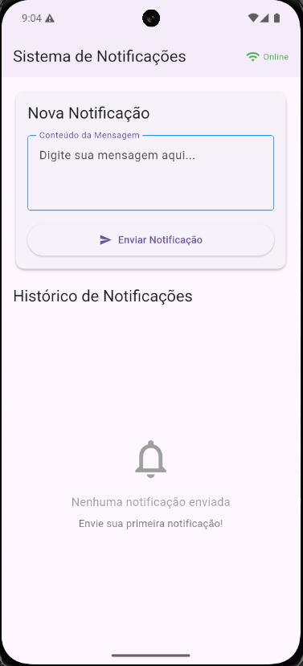
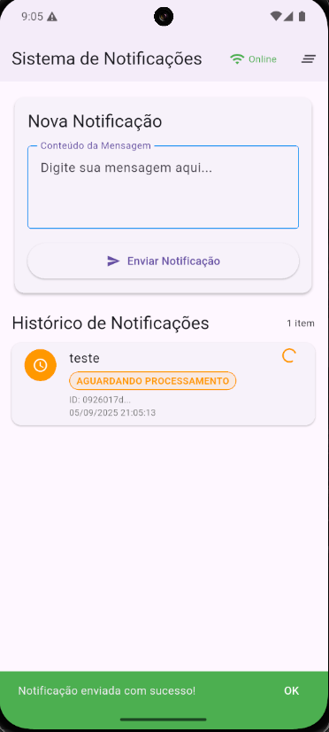

# notifications_flutter

Aplicativo Flutter para envio e monitoramento de notificações via API.

Este repositório contém um cliente simples para enviar notificações a um
serviço HTTP REST e consultar periodicamente o status de processamento das
mensagens. A interface oferece histórico local de notificações, indicações de
status (pendente, processando, sucesso, erro) e tratamento básico de erros.

## Principais arquivos

- `lib/main.dart` - ponto de entrada do app.
- `lib/presentation/home_screen.dart` - tela principal (envio e histórico).
- `lib/models/notification.dart` - modelo interno de notificação.
- `lib/services/api_service.dart` - cliente HTTP que fala com a API.
- `pubspec.yaml` - dependências do projeto.

## Funcionalidades

- Enviar notificações (mensagem curta) ao backend.
- Consultar periodicamente o status de cada notificação (polling a cada 5s).
- Indicar estado de conectividade (online/offline) com o servidor.
- Histórico local em memória com cores/ícones por status.
- Limpar todas as notificações.

## Dependências importantes

Definidas em `pubspec.yaml`:

- Flutter SDK
- `http` - para chamadas HTTP
- `uuid` - para gerar IDs únicos de mensagem
- `equatable` - utilitários para modelos (presente no pubspec)
- `flutter_bloc` - está listado como dependência (não necessariamente usado na UI atual)

## Requisitos

- Flutter SDK (compatível com Dart SDK >= 3.8.1 conforme `pubspec.yaml`).
- Um emulador ou dispositivo (Android/iOS/desktop) configurado.

## Como executar (desenvolvimento)

1. Instale as dependências:

```powershell
flutter pub get
```

2. Execute no emulador/dispositivo:

```powershell
flutter run
```

Observação: ao rodar em um emulador Android padrão do Android Studio, o
endereço especial `10.0.2.2` mapeia para `localhost` da máquina host. O
projeto atualmente usa `http://10.0.2.2:8081` como `baseUrl` em
`lib/services/api_service.dart`.

Se você for rodar contra um servidor remoto ou em um dispositivo físico,
altere `_baseUrl` em `ApiService` para o endereço correto (por exemplo,
`http://192.168.0.x:8081` ou um domínio público).

## Endpoints esperados pela API

O `ApiService` faz requisições para os seguintes recursos (padrão atual):

- POST `$_baseUrl/api/notificar` -> Envia uma notificação. Espera JSON com
	`{ "mensagemId": "<id>", "conteudoMensagem": "<texto>" }`.
- GET `$_baseUrl/api/status/<mensagemId>` -> Retorna JSON com ao menos `{ "status": "<STATUS>" }`.
- GET `$_baseUrl/api/health` -> Health check (200 = online).

Observação: o formato exato da resposta de `status` utilizado pelo app espera
um campo `status` no corpo JSON. Ajuste `ApiService` se o backend diferir.

## Testes

Este projeto já contém um arquivo de teste gerado (`test/widget_test.dart`).
Execute os testes com:

```powershell
flutter test
```

## Troubleshooting

- Erro de conexão/timeout: verifique se o backend está rodando e se o
	`_baseUrl` em `ApiService` está correto para o ambiente (emulador vs
	dispositivo físico).
- Em emulador Android, use `10.0.2.2` para apontar ao `localhost` do host.
- Em dispositivo Android físico, use o IP da máquina na rede (ex.: `192.168.x.x`).

## Melhorias sugeridas (próximos passos)

- Persistir histórico em armazenamento local (Hive/SharedPreferences/SQLite).
- Substituir polling por WebSocket ou Server-Sent Events para updates em tempo real.
- Adicionar testes unitários e de integração para `ApiService`.
- Adicionar tela de configurações para alterar `baseUrl` em runtime.

## Contribuindo

1. Fork o repositório.
2. Crie uma branch feature/fix: `git checkout -b feature/minha-melhora`.
3. Faça commits pequenos e claros.
4. Abra um Pull Request explicando as mudanças.

## Licença

Sem licença especificada — adicione um `LICENSE` se quiser liberar o código
sob termos específicos (por exemplo MIT).

---

Se quiser, eu posso também:

- Adicionar um arquivo `CHANGELOG.md` e `CONTRIBUTING.md`.
- Criar um exemplo de backend (mock) rápido em Node/Express para testar localmente.

A seguir eu atualizei o README com estas informações.

## Screenshots

Adicione capturas de tela do app na pasta `assets/docs` e referencie-as aqui com caminhos relativos. Exemplos:




Se preferir, nomeie as imagens como `screen1.png`, `screen2.png`, etc. Para alta qualidade use PNG e resolução de tela de dispositivo (por exemplo 1080x2340).

Dica: arraste/coloque os arquivos de imagem em `assets/docs` no seu repositório; o GitHub exibirá as imagens automaticamente no README.
